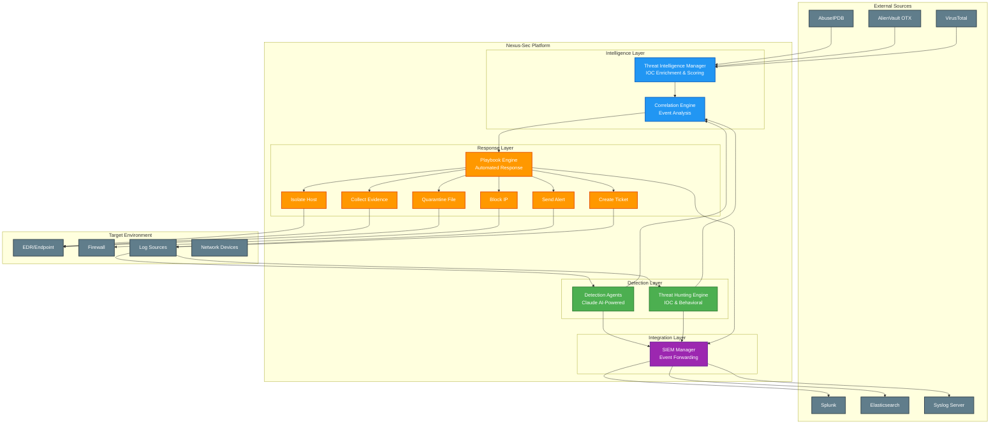

# Nexus-Sec Architecture Diagram

This file contains the architecture diagram in Mermaid format for GitHub rendering.

## System Architecture

## Component Descriptions

### Detection Layer
- **Detection Agents**: AI-powered autonomous agents using Claude for threat analysis
- **Threat Hunting Engine**: Proactive IOC hunting and behavioral analytics

### Intelligence Layer
- **Threat Intelligence Manager**: Enriches IOCs with reputation data from multiple feeds
- **Correlation Engine**: Combines data from multiple sources to identify complex threats

### Response Layer
- **Playbook Engine**: Orchestrates automated incident response workflows
- **Response Actions**: 6 built-in actions for comprehensive incident handling

### Integration Layer
- **SIEM Manager**: Forwards all security events to enterprise SIEM platforms
